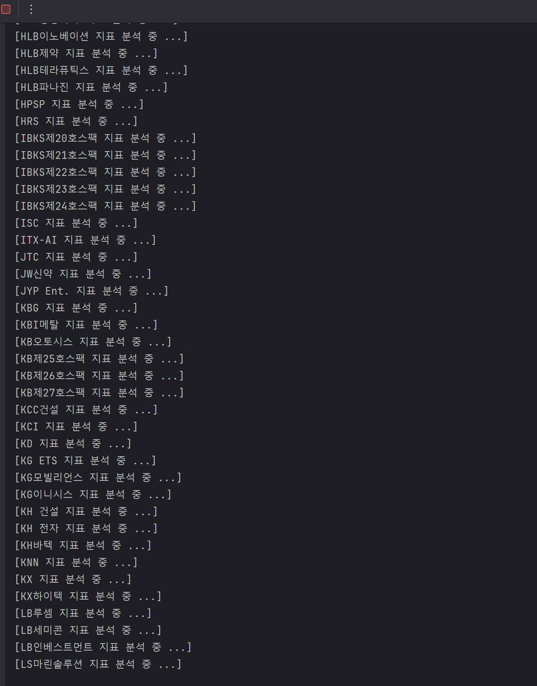

주식 지표 별 분석 정확성 및 종목 추천 *with MongoDB
---
# Project Object And Vision : 주식 별 주식 지표 (MACD, 일목균형표, 이동평균선) 추이 정확성(확률) 과 분석
## [제안서](https://github.com/20190511/StockProject/blob/master/%EC%BB%B4%EA%B0%9C%EB%A1%A0%20%EC%A0%9C%EC%95%88%EC%84%9C.pdf)
## Status Board
- [Succeed] : Get A Daily Stock Data and calculate Them.
- [Retrieve] : Try to modify a DataBase Structure. (TranSaction Mode -> List Mode)
- [Retrieve] : Auto-Update Stock Programming (15:30 : Close time in Stock)
- [Being Researching] : Speed Up - Get DB Mechanism and Scheme. 

## 기술 Stack
```commandline
0. Krx, NaverAPI, 한국투자증권 API : GET Daily Stock Information
1. Python : GET 데이터 -> MongoDB 
    Install line ---
    A. pymongo : mongoDB 의 Python Cursor 모듈
    B. pandas : DataFrame 사용
        # SMA, EMA 정규화 계산 모듈 : 인위적으로 다운로드 해줘야함 (Windows 기준) 
    C. talib : pip install TA_Lib-0.4.24-cp310-cp310-win_amd64.whl 
    D. pykrx : Get 데이터 모듈
2. JavaScript(React, Node.js) : Front-end
```



## DataBase Infrastructure
- [첫 번째 서버](https://cloud.mongodb.com/v2/65eb18d3c025ed475766b68b#/metrics/replicaSet/65eb19fd3a98b5058ee942d0/explorer/DayInfo)
- [두 번째 서버](https://cloud.mongodb.com/v2/65efca9dba57dc67b8cb647d#/metrics/replicaSet/65efcad9b8aae4715087d853/explorer/DayInfo/Analys/find)
```commandline
DB1. DayInfo : 일별 주식 데이터 보관 데이터 베이스 (Database 분리 : 1(첫번째 서버), 2(두번째 서버)
    > Info : 주식 일봉 데이터 저장 테이블
        {날짜, 시가, 고가, 저가, 거래량, 등락률, 시가총액, 거래대금, 상장주식 수
        기관합계_매수, 기타법인_매수, 개인_매수, 외국인합계_매수, 전체_매수,
        기관합계_매도, 기타법인_매도, 개인_매도, 외국인합게_매도,
        회사명, 티커}
    > Cals : 주식 별 지표 계산 테이블
        {날짜, SMA5, SMA10, SMA20, SMA60, SMA120, MACD, 
        MACD_Signal, MACD_Histogram, 전환선, 기준선, 선행스팬1, 선행스팬2, 후행스팬,
        선행스팬1_미래, 선행스팬2_미래, 9일_최고가, 26일_최고가, 회사명, 티커}
    > Analys : 주식 별 지표 분석 테이블
        { 날짜,
        60일 이동평균선 추이, 전환선 기준선 가까움(후행), 전환선 기준선 가까움, MACD 상태, 후행스팬 x 전환선_기준선후행스팬 x 봉, 
        선행스팬 꼬리방향, 봉과 구름대 ,전환선 x 기준선 ,봉 x 전환선_기준선,
        5/10/60/120일 이동평균선 통과여부, 9/26일 최고가 추이, 1일전 가격 비교,
        회사명, 티커
        }
    
DB2. StockCode : KOSPI, KOSDAQ Ticker 정보 데이터베이스
    > KOSPI : {"날짜", 
    > KOSDAQ :
```

## Developers
1. 배준형 : SSU CES 19, Back-End, Daily Information Infra. Implementation
2. 서유준 : SSU CES 19. Back-End, Real Time Information Infra Implementation (Reserved)
3. 이준혁 : SSU CES 18, Front-End (Android)
4. 유승준 : SSU CES 19, Front-End (Web)